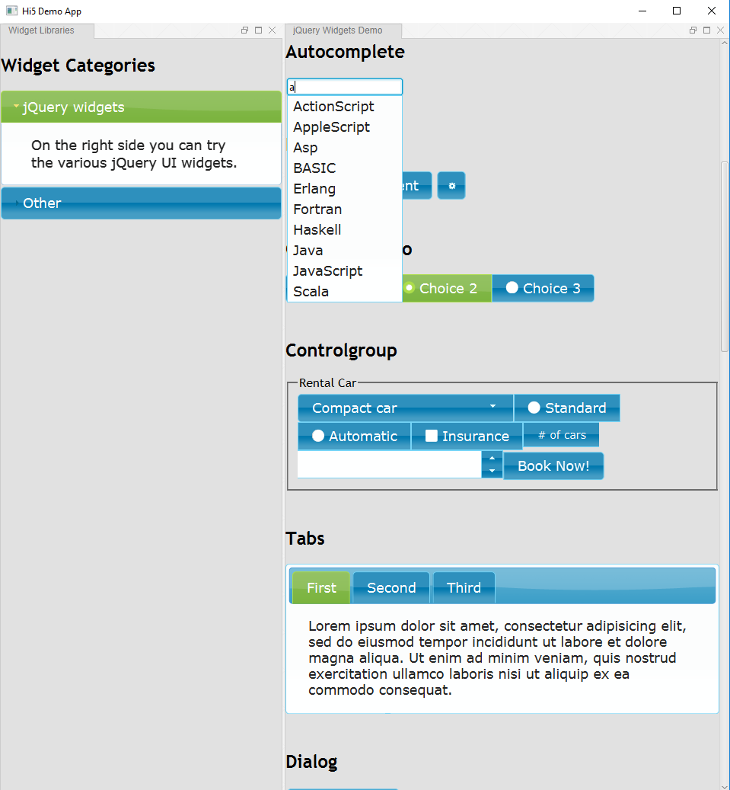

# hi5
HTML5 Renderer for Eclipse 4 applications

# Server side
On the server side (backend) the infrastructure of the Eclipse RCP platform is handling requests that the web client doing. This includes collecting all available E4 fragments and merging them into the application model. Next, the merged application model is transformed into a HTML DOM representation which then sent to the client via HTTP.

With the Eclipse Communication Framework (ECF) there is also great support for a service driven development approach as OSGi services can serve as web services, for example, using ECF's JAX-RS integration.

# Client side
On the client side you can use your favorite framework/library to provide a smooth and reactive UI. By default, jQuery, jQuery UI and jQuery mobile are used.

# Deployment modes
The application can be deployed in several modes:
typical server/client mode: Eclipse RCP backend runs on a server and the client runs in a web browser
local mode: Eclipse RCP backend runs locally and the client runs in a JavaFX WebView instance

# Demo
The following screenshot is a demo showing the various jQuery UI widgets running in a JavaFX WebView instance.

