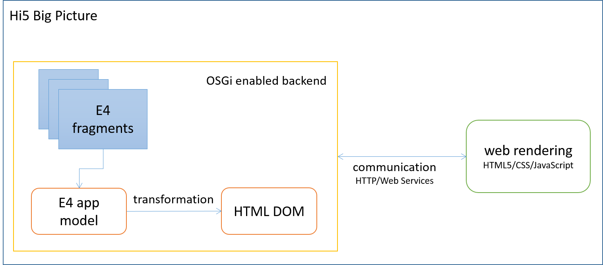

# hi5
HTML5 Renderer for Eclipse 4 applications.
The aim is not to be able to run your existing Eclipse RCP code with minor changes in a web browser. Instead this is a complete paradigm shift in Eclipse RCP development allowing to adapt the latest web development trends and technologies.

These are the major assumptions driving the development of this project:

- Eclipse RCP and OSGi form a stable/robust and highly modular and enduring technology stack for back end logic (server side programming)
- even if the life time of web frameworks is very short (compared to, for example, Eclipse frameworks and projects), they reflect the latest trends in the IT regarding, for example, UX design
- web development technologies are generally much faster to master than, for example, getting started with SWT or JavaFX, this allows for more rapid recruitment of new team members in (running projects) [my subjective observation]
- web development tooling is sufficient (for example, all major browsers have built-in support for JavaScript debugging)

# Server side
On the server side (backend) the infrastructure of the Eclipse RCP platform is handling requests that the web client is doing. This includes collecting all available E4 fragments and merging them into the application model. Next, the merged application model is transformed into a HTML DOM representation which is then sent back to the client via HTTP.

With the Eclipse Communication Framework (ECF) there is also great support for a service driven development approach as OSGi services can serve as web services, for example, using ECF's JAX-RS integration.

# Client side
On the client side you can use your favorite framework/library to provide a smooth and reactive/responsive UI.

# Deployment modes
The application can be deployed in several modes:
- typical server/client mode: Eclipse RCP backend runs on a server and the client runs in a web browser
- local mode: Eclipse RCP backend runs locally and the client runs in a JavaFX WebView instance

# Maven Build
- checkout repo
- switch to repo's root folder
- mvn clean install

Update site is contained in folder:

=> releng\de.metadocks.hi5.tycho.update\target\repository

Platform specific demo products are contained in:

=> releng\de.metadocks.hi5.tycho.product\target\products

# Real world example
The following screenshot shows a real world example in action (the website is in german and deals with [mental self-coaching](http://syflux.de "syflux.de")):

# Current Status
[x] means supported, [ ] means not yet implemented, [~] means covered by third party lib

| E4 API | Hi5 |
| --- | --- |
| App model, fragments | [x] |
| Window Menu | [x] |
| IEclipseContext/Scoping | [ ] |
| DI | [ ] |
| Data Binding | [~] |
| Key Bindings | [ ] |
| ECommandService/EHandlerService (commands, handlers) | [ ] |
| ESelectionService (part selections) | [ ] |
| EMenuService (context menus) | [ ] |
| EPartService (parts management) | [x] |

# Dependencies

| Project | License | Used for | Required? |
| --- | --- | --- | --- |
| [Eclipse 4](https://wiki.eclipse.org/Eclipse4) | EPL | defining/managing contributions of the single-page web application | yes |
| [Eclipse Modeling Framework](https://eclipse.org/modeling/emf/) | EPL | used by Eclipse 4 to model the workbench | yes |
| [RequireJS](http://requirejs.org) | MIT | client side dependencies management (AMD compliant implementation) | yes |
| [w3.css](http://www.w3schools.com/w3css/) | No Licence | responsive layout | yes |
| [jQuery](https://jquery.com) | MIT | client side DOM manipulation | yes |
| [Jersey](https://jersey.java.net) | CDDL 1.1 | JAX-RS OSGi integration | yes |
| [Eclipse Communications Framework](https://www.eclipse.org/ecf/) | EPL | web services support | no |
| [Eclipse Texo](https://wiki.eclipse.org/Texo) | EPL | de/serialization of EMF models from/to server/client in JSON format | no |
| [rivets js](http://rivetsjs.com) | OS | JS data binding | no |

# License
This project is licensed under the Eclipse Public License (EPL).
